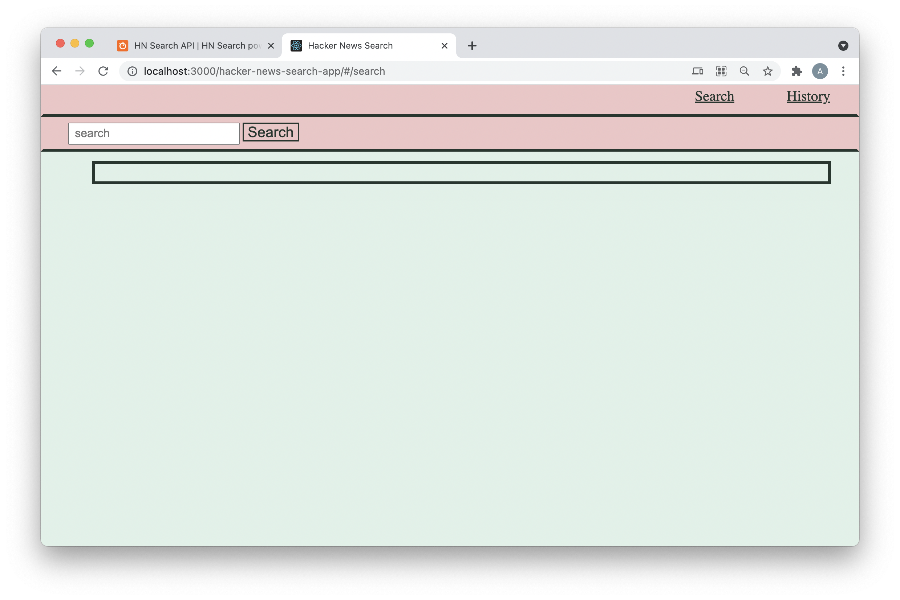
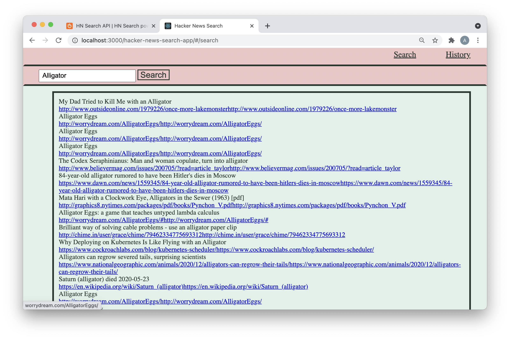
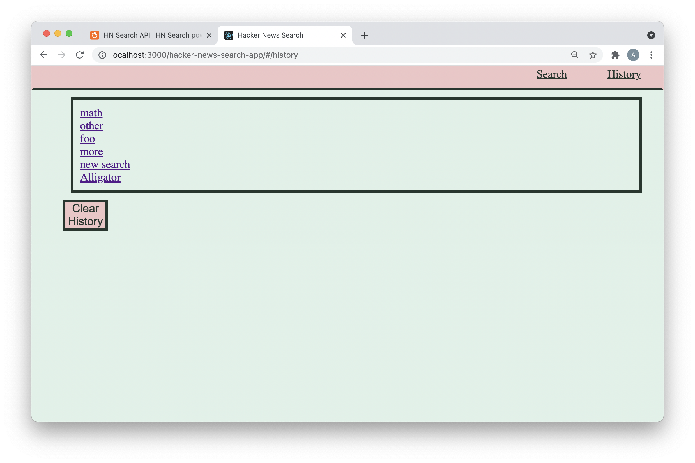
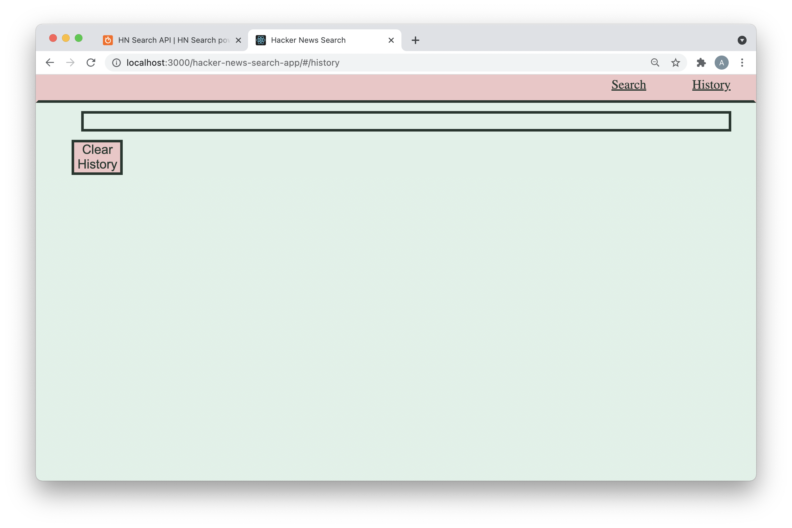

# Hacker News Search App 

here you will find an application built to search and display articles from Hacker Rank News

## Installations : 

react 
react-dom
react-router-dom
GitHub Pages

## Directions :

to run locally :

    - clone from Github Repo
    - open integrated terminal
    - npm i 
    - npm run start 
    - the application will now run on localhost

to run from web : 

    - go to : 
    - you will open to the search page 
        - here you can use the search bar to search hacker Rank News database 
        - you can only run one search at time but you can run as many searches as ou would like
        - use the nav bar at the top to navigate over to the history page 
    - history page 
        - past search parameters will be displayed on this page 
        - you can click on any past search on the list and it will take you back to / re run that search 
        - you can use the the clear search history button to clear you search history list if it is too long/ no longer serves you 
        -use the nav bar at the top to navigate back to the search page 

## Pictures : 

open to :
 

with search: 

history page :

cleared history : 

## GitHub :

Repo : https://github.com/austenhughes/hacker-news-search-app
Deployed GHpages : https://austenhughes.github.io/hacker-news-search-app/

## Recourses : 

W3schools : https://www.w3schools.com/  
Mozilla : https://developer.mozilla.org/en-US/  
Stackoverflow : https://stackoverflow.com/  
Hacker News API : https://hn.algolia.com/api  
React : https://reactjs.org/  
GitHub Pages : https://pages.github.com/

## find me at : 

Email : austen.hughes.91@gmail.com
 
GitHub : https://github.com/austenhughes
 
LinkedIn : https://www.linkedin.com/in/austen-hughes-97bb0b202/ 
 
Portfolio : https://austenhughes.github.io/React-portfolio/#/

